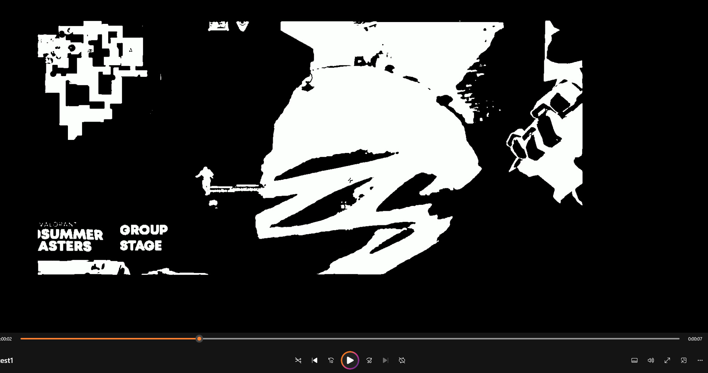

# VidFlow 🎬

**An automated pipeline that turns hours of raw Twitch/gameplay VOD footage into a condensed highlight reel — no manual scrubbing required.**

[](https://www.python.org/)
[](https://opencv.org/)
[](https://ffmpeg.org/)
[](https://python-poetry.org/)
[](./LICENSE)

---

## What it does

Editing a 4+ hour stream VOD down to "the good parts" by hand is slow and tedious. VidFlow automates that first pass: point it at a long video and it hands back a much shorter, condensed cut built only from the clips it scored as the most interesting.

```
Long VOD (hours)  ──▶  VidFlow  ──▶  Condensed highlight video (minutes)
```

It's built as a **CLI application with a self-contained video/CV pipeline**, driven by audio analysis (find the "interesting" parts) and computer vision (score how visually eventful each part is), rather than just cutting on volume alone.

## How it works

VidFlow processes video through a chain of independent, swappable pipeline stages — each stage does one job, caches its output to disk, and hands off to the next:


1. **Silence detection** — runs `ffmpeg`'s `volumedetect`/`silencedetect` filters over the raw audio track and auto-derives a silence-threshold (dB) specific to that recording, instead of relying on one hardcoded value.
2. **Clip segmentation** — the non-silent windows are parsed with regex, merged if they're close together, and filtered by minimum duration to produce a clean list of candidate clip boundaries.
3. **Video splitting** — `ffmpeg` cuts the source video into individual clips along those boundaries, with padding added so cuts don't feel abrupt.
4. **Visual scoring** — each clip is opened frame-by-frame with OpenCV. A region of interest is cropped out and run through Gaussian thresholding and Canny edge detection; the resulting "white pixel" density is used as a proxy for on-screen activity/action.
5. **Ranking & compilation** — clips are scored, averaged, and anything below the average is dropped. The remaining clips are concatenated via `ffmpeg`'s demuxer into a single output video.

The pipeline itself is implemented as a small **finite-state machine** (`PipelineEngine` + `Machine` + `Pipe` base class) — each stage decides what runs next (`on_done`) and how to recover on failure (`on_error`), which made it straightforward to add/reorder stages (download, cache, analyze, cut, compile, upload) without rewriting a monolithic script.

<p align="center">
  
</p>

## Tech stack & concepts

| Area | Tools / Techniques |
|---|---|
| Language | Python 3.9+ |
| Video processing | FFmpeg (via `ffmpeg-python`), silence/volume filters, stream demuxing |
| Computer vision | OpenCV — Gaussian blur, thresholding, Canny edge detection, SIFT keypoint experiments |
| Architecture | Finite-state machine pipeline, stage caching to avoid redundant reprocessing |
| CLI/UX | Click (flags), Questionary (interactive prompts) |
| Packaging | Poetry, published as a `pipx`-installable console script |
| Experimentation | Background subtraction, optical flow, ROC-curve threshold tuning (see [`experiment/`](./experiment)) |

## Project structure

```
src/VidFlow/
├── cli.py                  # entry point — click flags + interactive prompts
├── modules/
│   └── pipeline_builder.py # PipelineEngine / Machine / Pipe base classes (the FSM)
├── pipes/                  # one file per pipeline stage
│   ├── dl_stage.py          # download VOD (Twitch)
│   ├── data_cache_stage.py  # ffmpeg volume/silence analysis
│   ├── analyze_data_stage.py# turn raw silence data into clip windows
│   ├── action_stage.py      # split source video into clips
│   ├── analyze_clip_stage.py# OpenCV scoring per clip
│   ├── compile_stage.py     # threshold + concatenate final video
│   └── upload_stage.py      # (in progress) auto-upload to YouTube
└── aggregate/               # reusable ffmpeg + OpenCV command wrappers
```

## Installation

Requires [FFmpeg](https://ffmpeg.org/) on your `PATH`, and [TwitchDownloaderCLI](https://github.com/lay295/TwitchDownloader) if you want to pull VODs directly by stream ID.

```bash
pipx install vidflow
```

For local development:

```bash
git clone https://github.com/andysit1/Video-Content-Pipeline.git
cd Video-Content-Pipeline
pip install -e .
```

## Usage

Once installed, `VidFlow` is available on your `PATH`:

```bash
VidFlow --help
```

| Flag | Mode |
|---|---|
| `-c`, `--compile` | Full pipeline: download → analyze → cut → **compile into one video** |
| `-e`, `--extract` | Run everything except the final compile step (useful for manual clip review/trimming before stitching) |
| `-o`, `--output` | Change the output directory for generated clips/videos |
| `-d`, `--dev` | Developer mode, points at a hardcoded local test video |

Running `VidFlow -c` will interactively prompt for a Twitch stream ID and an output video name, then run the full pipeline end-to-end.

## Roadmap

- [ ] Support compiling directly from a local video file (skip the Twitch download step)
- [ ] Automated upload stage (YouTube API integration is scaffolded)
- [ ] Smarter clip ordering (currently sorted by score; exploring scatter/diversity heuristics so the final cut isn't front-loaded with similar clips)
- [ ] More video examples in this README

## Background

This started as a personal project to speed up editing long Valorant stream VODs for a college esports club — cutting hours of footage down to highlight-worthy moments by hand didn't scale. It's since become a way to explore video/audio signal processing and pipeline architecture design end-to-end, from raw ffmpeg filters up through OpenCV-based scene scoring.

## License

[MIT](./LICENSE) © Andy Sit
